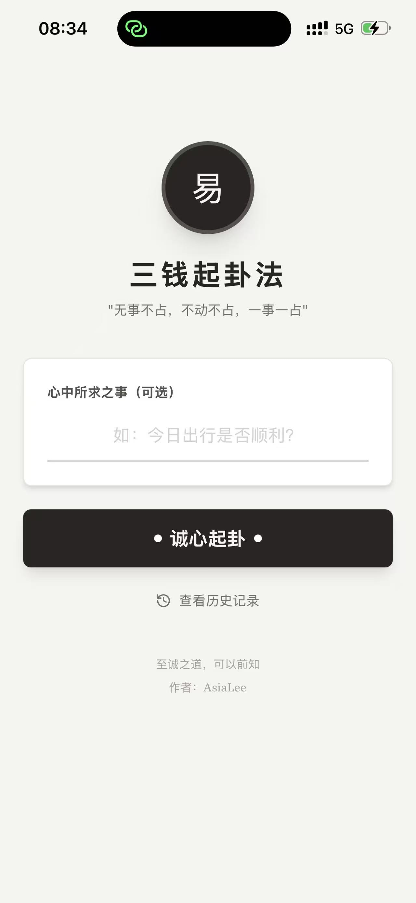
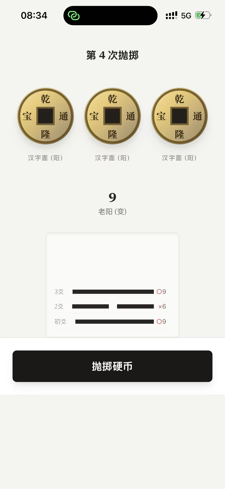
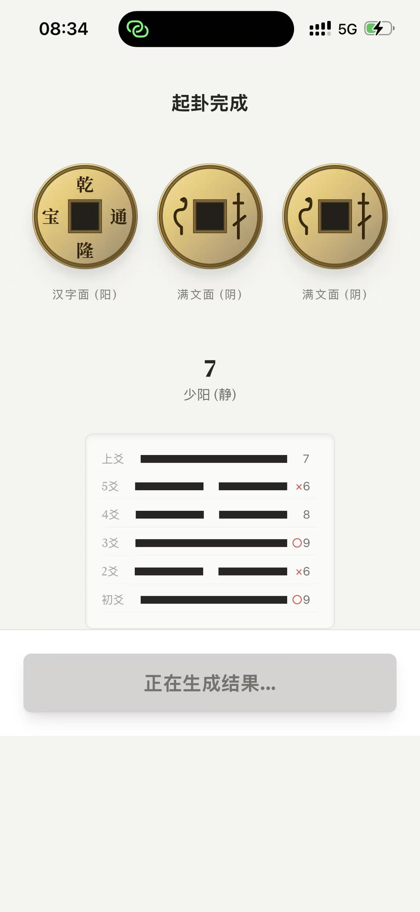
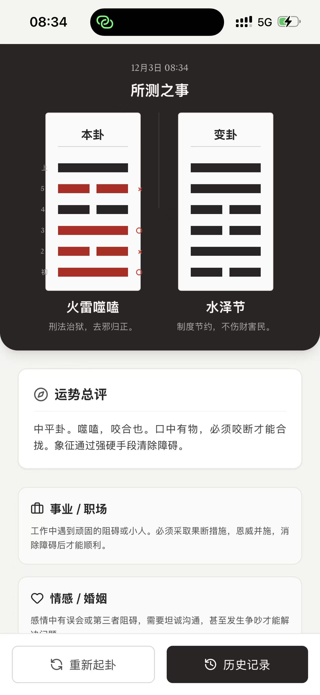

# 三钱起卦法

一个基于曾仕强教授“三枚硬币起卦法”的单机版 Web 工具。支持抛掷硬币生成六爻、自动推导本卦与变卦、给出运势总评与分领域建议，并在本地保存历史记录。

## 功能特性
- 起卦流程：三枚硬币动画抛掷，自动判定阴阳与动静
- 卦象展示：本卦/变卦六爻并列展示，含名称与简述
- 解读信息：总评、事业、情感、曾老指引、动爻细节
- 本地历史：记录保存、删除、清空，一键回看
- 纯前端离线：不依赖任何后端或外部 AI 服务

## 快速开始
- 开发启动：`npm run dev`，默认 `http://localhost:3000`
- 构建生产：`npm run build`，产物在 `dist/`
- 本地预览：`npm run preview`，默认 `http://localhost:4173`

## 目录结构
```
ThreeCoins/
  ├─ App.tsx            # 应用主界面与视图切换
  ├─ index.tsx          # React 入口挂载
  ├─ index.html         # 页面模板与入口脚本引入
  ├─ constants.ts       # 64卦与动爻解读数据
  ├─ types.ts           # 类型定义
  ├─ utils.ts           # 起卦、计算与本地存储工具
  ├─ vite.config.ts     # Vite 配置（已移除 Google AI 相关）
  ├─ package.json       # 项目依赖与脚本
  └─ README.md          # 项目说明
```

## 效果预览

<p>
  
  
  
</p>
<p>
  
  
  
</p>

## 技术栈
- 框架：React 19 + Vite 6
- UI：Tailwind CSS（通过 CDN 注入）
- 图标：`lucide-react`
- 存储：浏览器 `localStorage`

## 使用说明
- 首页输入心中所求（可选），点击“诚心起卦”开始抛掷
- 连续 6 次抛掷完成后，自动生成本卦与变卦
- 在结果页查看总评、分项建议与动爻详情
- 历史页可回看、删除或清空记录

## 注意事项
- 无需配置任何 API Key，本项目完全本地运行
- `index.html` 通过 `<script type="module" src="/index.tsx">` 引入入口
- 开发端口在 `vite.config.ts` 中设为 `3000`，可按需修改
- 若页面空白，优先检查入口脚本与浏览器控制台报错

## 部署
- 构建：`npm run build`
- 将 `dist/` 目录部署至任意静态网站服务（如 Nginx、Netlify、GitHub Pages）

## 许可
- 本项目仅作为传统文化学习与娱乐用途，严禁用于迷信与不当商业宣传。
